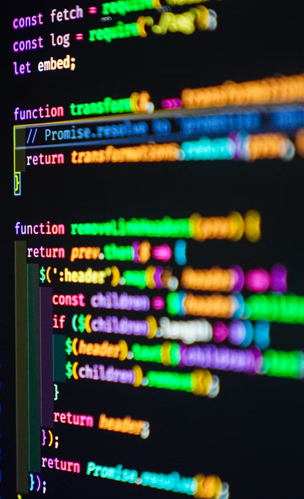

<h1 align="left">
  
  &nbsp; Welcome!
</h1>

🇧🇷 🇵🇹 For portuguese version, click [here](./README-PT.md).

### Overview

- 💻 Junior FullStack Software Engineer

- 🚀 I'm hubnauta at [Hublocal](http://hublocal.com.br/).

- 📕 Iginte's student at [Rocketseat](https://github.com/Rocketseat).

- 🎓 Bachelor's Degree in Information Systems at [Federal Institute of the North of Minas Gerais](https://ifnmg.edu.br/januaria) (in progress).

- 💾 Information Technology (IT) at [Federal Institute Goiano](https://ifgoiano.edu.br/urutai).

  

### 🛠 &nbsp; Stack

  
  
  
  
  
   
  
  
  

### 🙋 &nbsp; Get to know me better

  
  
  

  

